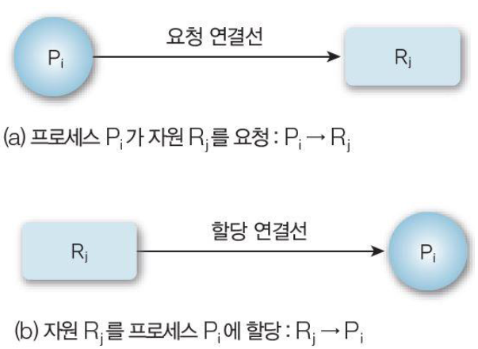

## 교착상태 (DeadLock)

---

> 자원이 한정적인 상황에서 두 개 이상의 프로세스가 각자 먼저 확보한 자원을 가진채 상대방의 자원을 필요로 할 경우
>
> 외부로부터의 조치가 없는 한 이들은 아무 일도 하지 못하고 계속 기다려야하는 무한대기에 빠지는데 이 상황을 **교착상태**라고 한다.

 

.assets/데드락.png)

- 문제점
  1. 해당 프로세스들이 더이상 실행되지 못하여 사용자들에게 응답 불가
  2. 보유된 자원들이 교착 상태에서 벗어나기 전까지 활용 불가

##### cf) 자원이란

1. 물리적인 분류

   1. 하드웨어 자원

      - 눈으로 보고 만질 수 있는 모든 자원

        ex) 하드디스크, 메모리

   2. 소프트웨어 자원

      - 만질 수 없는 자원

        ex) 데이터, 메시지

2. 선점 가능성으로의 분류

   1. 선점 가능 자원 (`preemptible`)
      - CPU, 메모리처럼 한 프로세스에 의해 사용 도중 선점되어 다른 프로세스에 할당해주었다가 다시 원래 프로세스에게 돌려줘도 불이익이 없는 자원
   2. 선점 불가능 자원 (`Nonpreemptible`)
      - 선점이 될 경우 자원을 빼앗긴 프로세스는 정상적인 진행을 포기해야하는 불이익을 받게 되는 자원

3. 사용되는 방식에 따른 분류

   1. 공유 가능 자원 (`sharable`)

      - 한 프로세스에 할당되 자원을 동시에 다른 프로세스가 할당받아 같이 사용 가능

   2. 배타적 사용 자원 (`Exclusive Use`)

      - 공유가 가능하지 않은 자원

        ex) CPU, 메모리, 테이프, 버퍼, 키보드, 모니터

4. 재사용 가능 여부에 따른 분류

   1. 순차적 재사용 가능 자원 (`Serially Reusable`)

      - 먼저 할당된 자원이 사용 후 반납(`Release`)되었을 때, 자원 자체는 계속 존재하여 또다른 프로세스에 할당 가능한 자원

        ex) CPU, 메모리, 테이프, 하드디스크, 버퍼, 프로그램

   2. 소모성 자원 (`Consumable`)

      - 사용 후 사라지는 자원

        ex) signal, message

### 프로세스가 자원에 취할 수 있는 행동

---

#### 필요한 자원에 대한 요청

- 요청된 자원이 사용가능하면 할당
- 사용중이면 해당 자원이 반납될 때까지 대기

#### 사용이 끝난 자원 반납

- System call로 자원 반납

	>  System call : [< 1-1.  **OS란** >](https://github.com/windy825/Study_box/blob/master/CS%EB%A9%B4%EC%A0%91/1.OS/1-1.%20OS%EB%9E%80/OS.md#system-call%EC%9D%B4%EB%9E%80) 참고

### 교착상태(Deadlock)의 발생 조건/원인

---

> 4가지 **모두 해당**하면 데드락 발생

1. 자원의 배타적인 사용

   - 한번에 프로세스 하나만 해당 자원 사용 가능

2. 자원의 부분 할당 / 점유 대기

   - 필요한 자원을 확보해나가다가 즉, 자원을 최소한 하나 보유하고

     다른 프로세스에 할당된 자원을 점유하기 위해 대기하는 프로세스 존재

3. 자원의 선점 불가능성

   - 다른 프로세스에 할당된 자원은 사용이 끝날 때까지 강제로 빼앗기 불가능

4. 자원에 대한 순환 대기

   - 대기 프로세스의 집합이 순환형태로 자원을 대기

### 교착 상태(Deadlock) 해결법

---

#### 1. 예방

- 데드락이 아예 발생하지 않도록 예방하기

#### 2. 회피

- 데드락 발생 가능성을 인정. 적절하게 회피하기

#### 3. 복구
- 데드락 발생을 허용하지만 데드락을 탐지하여 회복하기

#### 예방 기법

---

1. 자원의 배타적 사용(상호 배제) 조건 방지

   - 모든 자원을 공유자원으로 두어 교착 상태 발생 차단

     -> *공유 가능한 자원이 될 수 없는 자원(프린터 등)이 있어 실현 불가능*

2. 자원의 부분 할당 방지 / 점유 대기 조건 방지

   - 프로세스들이 필요한 모든 자원을 미리 할당받아 실행

     -> *자원 낭비 및 무한 대기 발생할 수 있다*

3. 자원의 선점 불가능 방지

   - 모든 자원이 선점 가능하도록

     -> *어떤 프로세스는 계속 일을 마치지 못하고 선점당해 무한대기에 빠질 수 있다*

4. 순환 대기 상황 방지

   - 자원 확보에 순서를 정해 교착상태 예방

     -> *자원 낭비 및 무한 대기 상태가 일어날 수 있다*
> #### 단점
> 시스템의 처리량이나 효율성을 떨어뜨리고 자원 낭비가 심함

### 회피 기법

---

- 알고리즘을 사용해 데드락을 막는 기법

- 시스템이 안정 상태로만 가도록 지속적으로 제어해 나가는 것을 의미

  > 안정 상태 : 모든 프로세스가 유한 시간 내에 정상 종료할 수 있는 상태, 교착 상태가 발생할 수 없는 상태

  > 불안정 상태 : 안전 상태가 아닌 경우, 교착 상태로 갈 가능성이 있고 방지책이 없는 상태

#### 다익스트라의 은행원 알고리즘 

- 은행은 **최소한 한 명에게 대출해줄 수 있는 돈을 가지고 있어야 한다**는 뜻에서 나왔으며, 바꿔말하면 **운영체제가 최소한 하나의 프로세스가 일을 수행할 수 있는 경우에만 요청을 허락하여 시스템의 자원을 할당해주는 것**

- 어떤 자원의 할당을 허용하는지에 관한 여부를 결정하기 전에,

  **미리 결정된 모든 자원들의 최대 가능한 할당량을 가지고 시뮬레이션 해서 안정상태(Safe state)에 들 수 있는지 여부**를 검사하는 방법

- 예시

  - 자원 여유량 : 2

  | 프로세스 | 현재 보유량 | 최대 요구량 |
  | -------- | ----------- | ----------- |
  | P1       | 1           | 4           |
  | P2       | 4           | 6           |
  | P3       | 5           | 8           |

  #### 안정한 상태인가?

  - 시스템 전체 자원 수 : `1 + 4 + 5 + 2 = 12`
  - P2가 추가로 자원을 요구할 경우 필요한 자원 : `2`
  - 여유량이 `2`이므로 P2 프로세스를 성공적으로 종료할 수 있고 이후 여유량은 `6`
  - 6개의 자원으로는 P1, P3 모두 커버 가능
  - 현재 상태에서 모든 프로세스가 정상적으로 종료할 수 있는 방법이 적어도 1개 이상이므로 교착상태 회피 가능 -> **안정한 상태**

  ##### P1, P3에서 자원을 먼저 요구 할 경우 불안전 상태가 되지만 은행가 알고리즘에 의해 P2를 먼저 실행하게되어 안전상태로 유지하는 것

>#### 단점
>
>시스템 내의 프로세스 수가 고정되어있어야함 -> 현실적으로 어려움
>
>자원수 역시 고정되어있어야 함 -> 현실적으로 어려움
>
>각 프로세스가 요구할 자원의 최대 개수가 알려져 있어야 함 -> 현실적으로 어려움
>
>각 프로세스는 할당받은 자원을 사용 후  반드시 반납해야 함

#### 탐지 기법

---

- 시스템에 **데드락이 발생했는지 여부를 탐색**

- **자원 할당 그래프**(RAG) 를 이용

.assets/RAG.png)

- 프로세스 `Pi`로부터 자원 `Rj`로의 방향 간선은 `Pi` ->`Rj`로 표현하며 이것은 프로세스 `Pi`가 자원 `Rj`을 요청하는 것으로 현재 이 자원을 기다리는 상태를 의미
- 자원 `Rj`로부터 프로세스 `Pi`로의 방향 간선은 `Rj`->`Pi`로 표현하며 이것은 자원이 프로세스 `Pi`에 이미 할당된 것을 의미

> #### 단점
>
> 자원을 요청할 때마다 탐지 알고리즘을 실행하면 그에 대한 오버헤드가 발생

cf) 오버헤드 : 어떤 처리를 하기 위해 들어가는 간접적인 처리시간 & 메모리

#### 복구 기법

---

1. 프로세스 종료 방식
   - 교착 상태에 빠진 모든 프로세스를 중단
     - 계속 연산중이던 프로세스들도 모두 중단되어 부분 경과가 폐기될 수 있음
   - 프로세스를 하나씩 중단시킬 때마다 탐지 알고리즘으로 데드락을 탐지하며 회복 
     - 매번 탐지 알고리즘을 호출 & 수행해야하므로 부담

2. 선점에 의한 방식
   - 필요한 자원을 가지고있는 프로세스에서 자원을 선점하여 교착상태를 해결할 때까지 그 자원을 다른 프로세스에게 할당해주는 방법
   - 우선순위가 낮은 프로세스, 수행된 횟수가 적은 프로세스 등을 위주로 프로세스의 자원을 선점

참고

### 기아상태(Starvation)

---

- 프로세스가 작업을 수행하지 못하고 무한히 기다리는 상태 (교착상태와 다름)
- 운영체제의 정책 중 공평성을 지키지 않는 스케줄링으로 인해서 특정 프로세스가 자원을 할당받지 못하는 상황

- 현실적으로 수행할 수 있는 작업이지만, 무기한 연기로 인해 수행할 수 없는 상태에 빠지는 것

- 프로세스의 우선순위에 따라 자원을 할당할 경우, 우선 순위가 낮은 프로세스들이 기아상태에 빠질 수 있다

- 해결 방안
  - 에이징 (aging) : 어떤 자원을 오래 대기할수록 해당 프로세스의 우선순위를 높여주는 것

#### 식사하는 철학자 문제

> <1-4. 병행 프로세스와 동기화> 참고