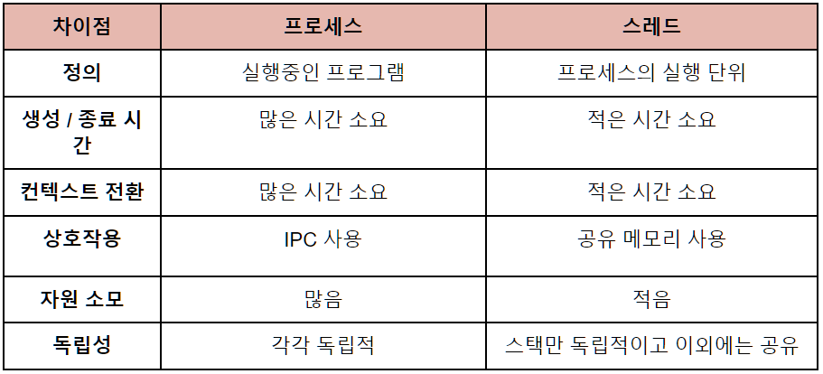
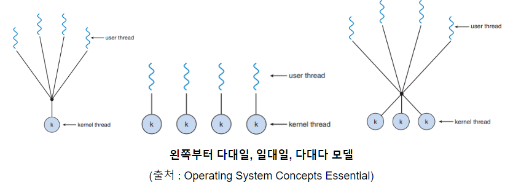
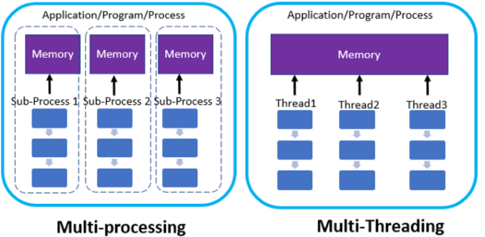
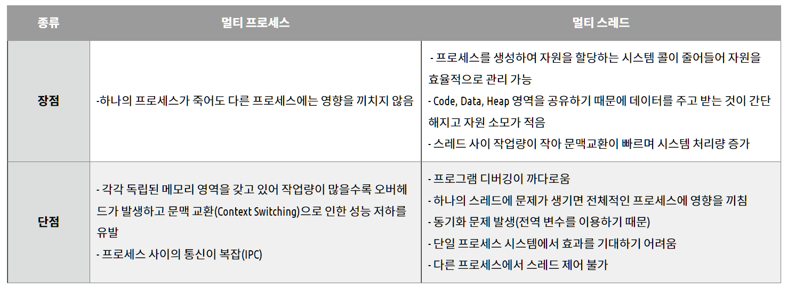

### 0. 프로그램 VS 프로세스
1. **프로그램**
      - 프로그램은 하드디스크에 저장되어 있는 하나의 파일, 수동적인 존재
      
      - 프로그램이 사용자에게 유용한 기능을 제공하기 위해서는 메모리에 로드되어서 프로그램 카운터(PC) 및 관련 자원의 집합을 가진 능동적인 존재로서 동작해야한다.
      
2. **프로세스**

      - 프로세스는 일반적으로 CPU에 의해 처리되는 사용자 프로그램, 시스템 프로그램 즉 실행중인 프로그램을 의미하며, 작업(Job) 태스크(Task)라고도 한다.
        
      - 프로그램은 일반적으로 하드디스크(보조기억장치)에 저장되어 아무 일도 하지 않는 상태이다. 프로세스는 실행하면서 stack pointer, data, text, register 등이 끊임없이 변한다. 
      
3. **프로세스의 메모리 공간(데이터와 명령어가 있는 공간)** 

      

### 1. 프로세스의 상태(프로세스 전이도)

- 생성(new) 
  - 갓 생성된 상태, OS의 커널에 `PCB `등이 생성된다.

- 준비(ready) 
  - CPU의 서비스를 받기 위해 Ready Queue에서 대기하고 있는 상태
  - 순서에따라 CPU를 할당받으면 실행상태가 되는데 이때 CPU를 할당받는 순서를 정하는 것을 `CPU 스케쥴링`이라고 한다.

- 실행(running) 
  - CPU에 의해 실행되고 있는 상태
  - CPU를 할당하는 것을 `Dispatch`라고 한다

- 대기(waiting or blocked)
  - I/O(입출력 연산)나 다른 event를 기다리며 멈춰있는 상태

- 종료(terminated)
  - 실행을 완료하는 등의 이유로 종료된 상태
  - 운영체제가 프로세스의 흔적과 PCB를 삭제하면 프로세스는 완전히 삭제된다.

### 2. PCB(Process Control Block)란?

- **프로세스 제어 블록**(PCB; Process Control Block) 혹은 프로세스 기술자(process descriptor)는 프로세스의 정보를 담고 있는 자료구조
- 운영체제가 프로세스를 다룰 때 프로세스 제어 블록을 이용해서 다루게 된다. 여기에 담기는 정보는 운영체제별로 다르다. 
  - 프로세스 번호(PID)
  - 프로세스 상태(Status)
  - 우선순위(Priority)
  - 프로그램 카운터 값(PC): 다음에 실행될 명령어의 주소가 들어있음
  - 메모리 포인터
  - Context Data
  - 할당받은 자원 목록
  - 계정 정보: CPU를 사용한 시간 등
  - 입출력 정보

### 3. 스레드

- **스레드**(thread)는 프로세스가 할당 받은 자원을 이용하는 실행 단위로 프로세스는 최소 한 개 이상의 스레드를 가진다.

- 스레드는 앞서 살펴본 프로세스와 구조가 다르다. 프로세스 주소 공간 중 코드, 데이터, 힙은 스레드 간 공유되며 스택만이 스레드 별로 할당된다. 그래서 스레드 간에는 이 공유 메모리를 이용해 상호작용을 할 수 있다.

  

### 4. 프로세스와의 차이점

### 5. 스레드의 종류

1. 사용자 레벨 스레드

   - 스레드 라이브러리에 의해 관리

   - 커널은 스레드의 존재를 모른다

   - 특정 스레드의 대기가 프로세스 내의 모든 스레드의 대기를 초래

   - CPU가 프로세스 단위로 할당되어 다중처리 환경이 주어져도 스레드 단위의 다중처리가 불가능함

2. 커널레벨 스레드

   - 모든 스레드의 관리를 커널이 관리

   - 다중처리 환경에서 한 프로세스 내의 다수의 스레드는 병렬처리가 가능함

   - 같은 프로세스에 속한 스레드간 스위칭도 커널개입이 필요해 Context Switching이 잦다.

### 6. 멀티 프로세스 VS 멀티 스레드

1. **멀티 프로세스**

   하나의 응용 프로그램을 여러 개의 프로세스로 구성하여 각 프로세스가 하나의 작업을 처리하도록 하는 것

   - 여러 개의 자식 프로세스 중 하나에 문제가 발생해도 다른 자식 프로세스에 영향이 확산되지 않음
   - 구현이 간단
   - 각 프로세스들이 독립적으로 동작(자원이 서로 다르게 할당됨) 하기 때문에 안정적
   - 멀티 스레드 보다 많은 메모리 공간과 CPU 시간을 차지
   - 작업량이 많을수록 오버헤드가 발생하고 Context Switching으로 인한 성능 저하 우려
   - 프로세스 간의 통신을 하기 위해서는 IPC를 통해야 함

    

2. **멀티 스레드**

   하나의 응용 프로그램을 여러 개의 스레드로 구성하여 각 스레드가 하나의 작업을 처리하도록 하는 것

   - 시스템의 자원과 처리 비용 감소(실행 속도 상승)
   - Context Switching이 빠름(스레드는 Stack영역만 처리하면 되기 때문)
   - 스레드 간의 자원\**(Code, Data, Heap)을\** 공유하고 있기 때문에 통신의 부담이 적어 응답 시간이 빠름
   - 스레드가 개별로 유기적으로 움직이고 있기 때문에 프로그램 테스트, 디버깅이 어려움
   - 스레드 간의 데이터 공유 시 동기화 문제 발생
   - 하나의 스레드의 오류로 전체 프로세스에 문제 발생
   - 너무 많은 스레드 사용은 오버헤드를 발생

3. **장단점**

   

