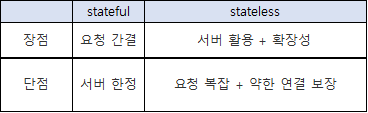
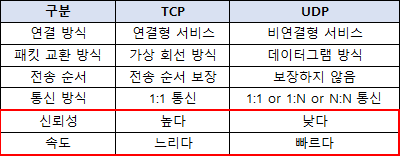
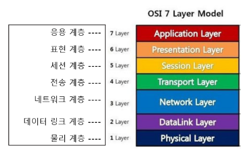

## HTTP(HyperText Transfer Protocol)

- 인터넷 상에서 데이터를 주고 받기 위한 서버/클라이언트 모델을 따르는 프로토콜
- 애플리케이션 레벨의 프로토콜로 TCP/IP위에서 작동
- 초기에는 HyperTEXT 형태의 문서를 전달하는데 주로 이용 되었으나, 현재는 거의 모든 형식의 데이터 전송

## 특징

- 클라이언트 서버 구조
  - 클라이언트가 서버에 요청을 보내면 서버는 그에 대한 응답을 보냄

- 무상태 프로토콜(Stateless)
  - 서버가 클라이언트 상태를 저장하지 않음

- 비 연결성(Connectionless)

- 거의 모든 파일 형식을 전송 가능

### stateful(상태 유지) vs stateless(무상태)

## [HTTP 역사](https://developer.mozilla.org/ko/docs/Web/HTTP/Basics_of_HTTP/Evolution_of_HTTP#http/3%20-%20http%20over%20quic)

- HTTP/0.9 : GET 메서드만 지원, HTTP 헤더 없음
- HTTP/1.0 : 메서드, 헤더 추가(⇒ HTML 이외 다른 파일 전송 가능)
- `HTTP/1.1` : HTTP의 첫번째 표준
- `HTTP/2` : 새로운 표준이 아닌 1.X 버전의 성능 개선
- HTTP/3 : TCP 대신에 UDP 사용, 성능 개선
- HTTP/1.1, HTTP/2는 TCP 기반이며 HTTP/3는 UDP 기반 프로토콜

## TCP / UDP

- `전송계층` 에서 사용 되는 프로토콜

  - 전송계층 : IP에 의해 전달 되는 패킷의 오류를 검사하고 재전송 요구등의 제어를 담당하는 계층

  

## [OSI 7계층](https://velog.io/@cgotjh/%EB%84%A4%ED%8A%B8%EC%9B%8C%ED%81%AC-OSI-7-%EA%B3%84%EC%B8%B5-OSI-7-LAYER-%EA%B8%B0%EB%B3%B8-%EA%B0%9C%EB%85%90-%EA%B0%81-%EA%B3%84%EC%B8%B5-%EC%84%A4%EB%AA%85)

- 네트워크에서 통신이 일어나는 과정을 7단계로 나눈 것으로 현재는 사용되지 않음.
  - updated TCP/IP 모델이 사용 됨.

- 7계층으로 나뉘며, 계층별 설명은 제목 링크 참조.

​		

