# IP


### IP 주소

- 컴퓨터 네트워크에서 장치들이 서로를 인식하고 통신을 하기 위해서 사용하는 특수한 번호.

  - 네트워크에서 한 대의 컴퓨터마다 할당되어 있음
  - 네트워크 상의 주소
    - 32비트(8비트씩 4개로 구분). 각각을 10진수로 표기
  - 네트워크별로 나뉘는 **‘네트워크 주소’**부와 네트워크 안에서 컴퓨터를 식별하기 위한 **‘호스트 주소’**부가 조합되어 구성


### IP란?

- OSI 참조 모델에서 제3계층인 네트워크 계층에 위치하는 네트워크 프로토콜

- 네트워크상의 기기에 대한 주소를 할당하는 역할과 그 주소를 바탕으로 **패킷**을 전송하는 역할을 함

- IP는 송신 데이터가 되는 **패킷**을 TCP/UDP와 같은 상위 계층으로부터 전달 받으면 **IP 헤더**라는 정보를 추가하여 네트워크로 내보낸다.
  - 패킷(packet) : 작게 분할된 데이터 덩어리 (택배)
  
  - IP헤더 : IP주소를 중심으로 한 정보의 집합 (택배에 붙어있는 운송장과 비슷)
  
    | 구분        | 내용                      |
    | ----------- | ------------------------- |
    | 받는 곳     | 192.168.0 (네트워크 주소) |
    | 받는 사람   | 3 (호스트 주소)           |
    | 보내는 곳   | 192.168.0                 |
    | 보내는 사람 | 2                         |

- IP에는 경로를 선택하는 방법에 대해서도 정의되어 있어 여러 개의 네트워크를 걸친 통신도 가능
  -  LAN과 외부 네트워크를 연결하는 기기인 라우터가 이 IP의 경로 선택(**라우팅**)을 지원
  - 송신자가 속한 라우터로부터 수신자가 속한 네트워크의 라우터로 패킷이 송출됨으로써 목적지에 도달 가능
    - 이와 같은 구조를 사용하여 세계 규모로 네트워크를 연결한 것이 바로 **인터넷**


### 노드

- 네트워크에 연결되어 있는 네트워크 기기나 네트워크의 연결 포인트를 통틀어 **노드**라고 한다.

  - 허브, 라우터, 컴퓨터 등...
  - 예를 들어 10노드라고 말하는 경우 네트워크상에 10대의 기기가 연결되어 있다는 것을 가리킨다.
  - 잡다한 기기가 혼재되어있는 네트워크 환경 속에서 이 기기들을 한마디로 나타내기 위해 사용하는 통칭
  - ‘노드 간에 패킷을 송수신한다’라는 경우 네트워크상의 기기 간에 패킷을 주고받는다는 뜻

  

### TCP/IP 프로토콜

- 인터넷 세계에서 표준으로 사용되고 있는 네트워크 프로토콜
  - 대부분의 웹 HTTP 통신, 이메일, 파일전송에 사용됨
- 제3계층의 IP와 제 4계층의 TCP를 중심으로 한 여러 프로토콜의 집합체를 총칭
- HTTP 등은 이 프로토콜을 기반으로 작동
- IP가 데이터의 배달을 처리, TCP는 패킷을 추적 및 관리 
- OSI 7계층처럼 추상적인 레이어 역할을 하는 것이 아니라 **실용적인 네트워크 연결**을 위해 만들어짐


### TCP (Transmission Control Protocol)

- 제4계층인 전송 계층에 위치하는 네트워크 프로토콜
- 제5계층(세션) 이상의 프로토콜로부터 통신 데이터를 받아 **패킷**으로 분할
- 그 패킷을 제3계층인 IP에게 전달하여 상대방에게 전달되도록 함
  - 분할된 패킷을 목적지에서 재조립
- **패킷의 수신을 확인**함으로써 패킷이 순서대로 올바르게 전달될 것을 보증
  - 패킷의 결손에 대한 보증이 없는 IP의 상위 계층으로써 **보증 장치**를 추가
  - 신뢰성이 높고 확실한 데이터 송수신이 가능 (연결 지향형 프로토콜)

#### TCP가 데이터 통신에 신뢰성을 확보하는 방법 (보증 장치)

- 통신 데이터를 패킷으로 분할할 때 시퀀스 번호를 붙여 둠 
  - 수신 측에서 이 번호를 체크하여 패킷의 순서가 올바르게 되도록 보증
- 수신측에서는 반드시 수신했다는 것을 나타내는 통지패킷(ACK 패킷)을 송신 측에 돌려보냄
  - ACK 번호는 시퀀스 번호에 1을 더한 숫자이며 해당 데이터를 잘 받았다고 고지하는 역할
  - Ex) 도착하면 알려줘/ 응~ 1번 잘 도착했어~(ACK 2)

##### 흐름 제어

- 보내는 측과 받는 측의 데이터 처리 속도 차이를 조절해줌 (호스트-호스트)

- 만약 ''송신측의 전송량 > 수신측의 전송량'' 일 경우 전송된 패킷은 수신측의 큐를 넘어서 손실될 수 있기 때문에 송신층의 패킷 전송량을 제어

  - 정지-대기 
    - 구조가 간단한 대신, 하나를 주고 응답을 받기 때문에 비효율적

  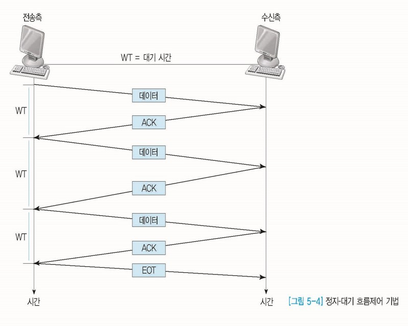

  - 슬라이딩 윈도우 

    - 정지-대기 기법의 비효율성을 개선. 
    - ACK패킷을 수신하지 않더라도 여러개의 프레임을 연속적으로 전송할 수 있음

    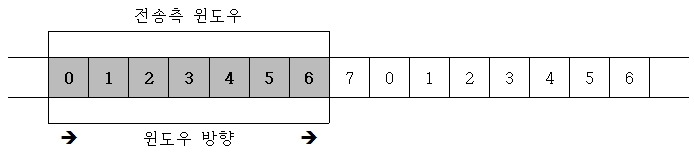

    ```
    위와 같은 구조에서 데이터 0,1을 전송했다고 가정
    ```

    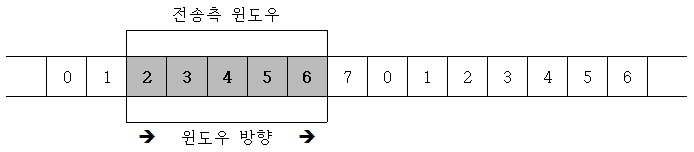

    ```
    슬라이딩 윈도우의 구조는 다음과 같이 변하며 윈도우의 크기는 전송한 데이터 프레임만큼 줄어들게 됨
    만약 수신측으로부터 ACK패킷프레임을 받게되면 ACK프레임에 따른 프레임의 수만큼 오른쪽으로 경계가 확장됨
    ```

    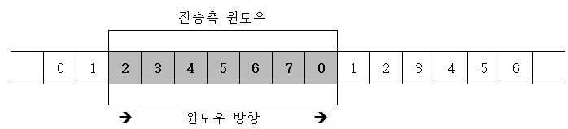

    

##### 혼잡 제어

- 네트워크 내의 패킷 수가 넘치게 증가하지 않도록 방지(호스트 - 네트워크)

- 송신된 패킷이 네트워크 상의 라우터가 처리할 수 있는 양을 넘어서 혼잡하게 되면 데이터가 손실될 수 있기 때문에 송신측의 전송량을 제어

  - 합 증가/ 곱 감소 (AI/MD)

    - 처음에 패킷을 하나씩 보내고 이것이 문제 없이 도착하면 창 크기를 1씩 증가시켜가면서 전송하는 방식
    - 만일 패킷 전송을 실패하거나 일정한 시간을 넘으면 패킷을 보내는 속도를 절반으로 줄임
    - 즉 네트워크가 혼잡해지고 나서야 대역폭을 줄이는 방식
    - 네트워크의 수용량 측면에서는 효율적으로 작동하지만 처음에 전송 속도를 올리는데 걸리는 시간이 너무 길다는 단점이 있음

  - 슬로우 스타트

    

    - AI/MD 방식과 마찬가지로 패킷을 하나씩 보내는 것부터 시작

    - 패킷이 문제없이 도착하면 각각의 ACK패킷마다 window size를 1씩 늘림

    - 즉 한 주기가 지나면 window 사이즈가 2배로 됨 (지수함수꼴로 증가)

      ```
      초기 혼잡 윈도우 크기 1로 전송 = 전송 호스트는 하나의 패킷만 전송
      2) 수신 호스트로부터 수신응답을 수신하면 윈도우의 크기를 2로 하여 전송
      3) 수신 호스트로부터 수신응답을 수신하면 윈도우의 크기 4로 하여 전송
      4) 수신 호스트로부터 수신응답을 수신하면 윈도우의 크기 8로 하여 전송
      ```

      - 미리 정해진 임계값에 도달할 때까지 증가
      - 임계값에 도달하면 혼잡회피 단계로 넘어감
      - 혼잡회피 : 윈도우의 크기가 임계값에 도달한 이후에 데이터의 손실이 발생할 확률이 높아지게 되어 데이터의 전송에 있어 조심하는 단계

      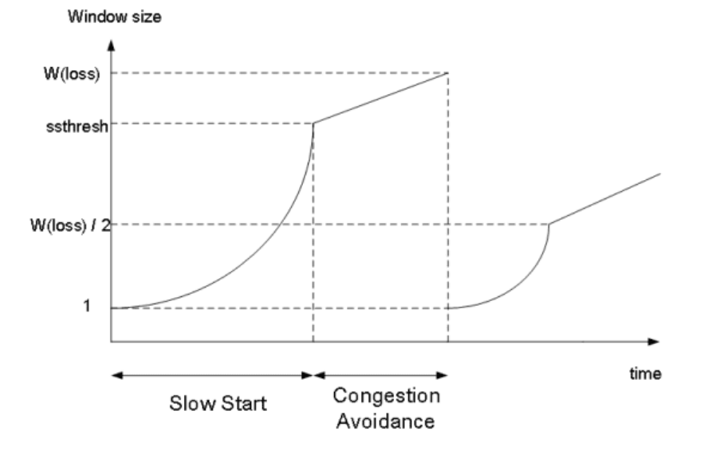
      
      ```
      전송한 데이터에 대한 ACK를 받으면 윈도우의 크기를 1씩 증가시킴
      (전송하는 데이터의 증가를 왕복시간 동안에 하나씩만 증가시킴)
      
      수신호스트로부터 일정시간동안까지 ACK를 수신하지 못하는 경우: 타임아웃 
      - 네트워크에 혼잡이 발생하였다고 인식
      - 윈도우의 크기를 1로 줄임
      - 동시에 임계값을 패킷 손실이 발생하였을 때의 윈도우 크기의 반으로 줄임
      ```
      
      
  
  - 빠른 회복(Fast Recovery)
    - 혼잡한 상태가 되면 window size를 1로 줄이지 않고 반으로 줄이고 선형증가 시키는 방법
    - 빠른 회복 정책까지 적용하면 혼잡상황을 한번 겪고 나서부터는 순수한 합 증가/곱 감소 방식으로 동작하게 됨

##### 오류 제어

- 오류검출과 재전송
- ARQ(Automatic Repeat Request)기법을 사용하여 프레임이 손상되었거나 손실되었을 경우 **재전송**을 통해 오류를 복구
  - 흐름제어 기법과 관련
    - "정지-대기" -> "정지-대기-ARQ"
    - "슬라이딩 윈도우" -> "GBn" & "Selective-Reject ARQ"

- 정지-대기-ARQ

  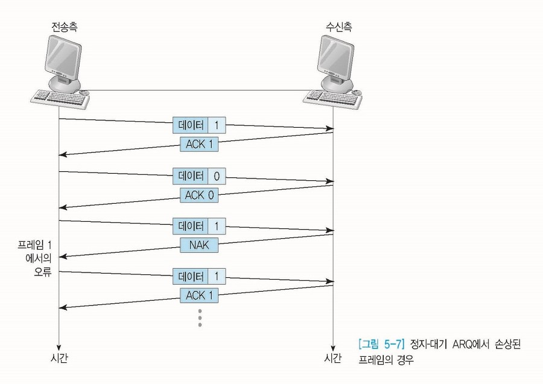

  - 송신측은 수신측에서 보내준 ACK를 받을 때까지 프레임의 복사본 유지
  - 식별을 위해 데이터 프레임과 ACK프레임은 각각 0,1 번호를 부여
  - 수신측이 데이터를 받지 못했을 경우 NAK를 보내고, NAK를 받은 송신측은 데이터를 재전송

- Go-Back-n-ARQ(GBn)

  - 전송된 프레임이 손상되거나 분실될 경우, **확인된 마지막 프레임 이후로 모두 재전송**
  - 슬라이딩 윈도우는 연속적인 프레임 전송 기법이므로, 송신측은 전송된 모든 프레임의 복사본을 가지고 있어야 함

  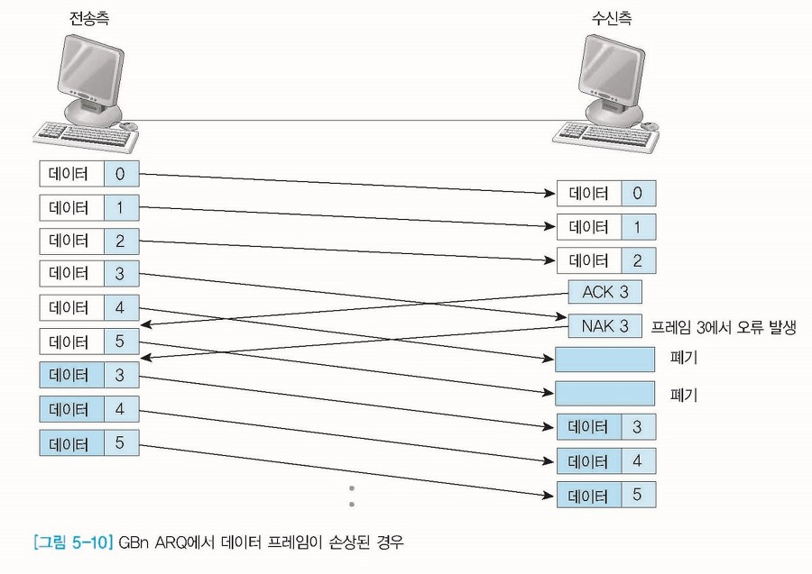

  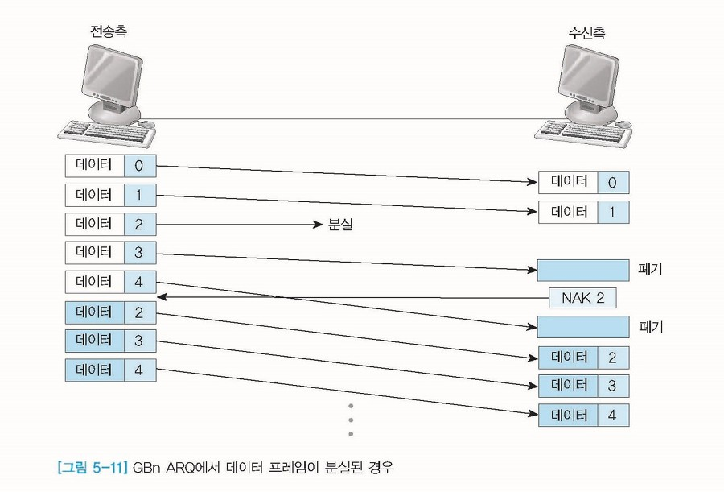

  ```
  ACK : 다음 프레임을 전송
  NAK : 손상된 프레임 자체 번호를 반환
  
  재전송 되는 경우
  1) NAK 프레임을 받았을 경우
  - 수신측에서 데이터 1을 받았는데 갑자기 데이터 3을 받게 된다면 데이터 2를 못받은 것이므로 NAK(2)를 보냄
  - 수신측은 NAK(2) 이후의 데이터를 모두 폐기함 
  - GBn ARQ는 NAK(2)을 받아 데이터를 재전송할 때, 2번 데이터만을 재전송하는 것이 아니라 2번 데이터 이후 데이터를 모두 재전송함
  
  2) 타임아웃
  - 송신측은 타임아웃동안 ACK 데이터를 받지 못했을 경우 마지막 ACK된 데이터부터 재전송
  ```

- Selective-Reject(SR) ARQ

  - GBn의 재전송되는 프레임 이후의 모든 프레임을 재전송하는 단점을 개선한 방법
  - **손상, 분실된 프레임만 재전송**
  - 그렇기 때문에 별도의 데이터 재정렬을 수행해야하며, 별도의 버퍼를 필요로 함

  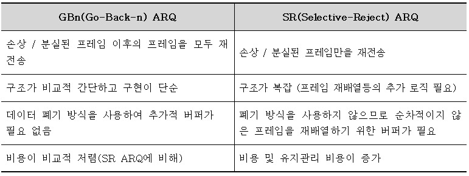

  

### UDP (User Datagram Protocol)

- 제4계층인 전송 계층에 위치하는 네트워크 프로토콜
- 비연결형 통신
  - 연결을 위해 할당되는 논리적인 경로가 없음
  - 지금부터 정보를 보낸다는 것을 상대편에게 통지하지 않고 갑자기 송신
- 상위 계층의 애플리케이션(세션)으로 부터 받은 데이터를 패킷으로 분할하여 IP를 사용하여 **송출하기만 함**
  - TCP처럼 수신 확인을 하지 않음
  - 중간에 패킷이 분실되어도 책임을 지지 않음
- 그럼 왜 사용하는가?
  - 수신 확인이나 패킷의 재전송과 같은 절차 때문에 TCP 프로토콜을 사용하면 무거워진다. 
    - 그래서 용도에 따라 신뢰성보다 가볍고 빠른 처리를 중시하는 UDP 프로토콜을 사용한다.
  - 시간적 연속성이 중요한 애플리케이션에서 이용하는 프로토콜
    - ex) 음성통화, 동영상 배포
    - 신뢰성은 떨어지지만 고성능이므로 실시간 용도에 적합
  - IP에 의한 데이터 전송 기능을 상위 계층(제 5계층 이상)에서 직접 다룰 수 있도록 하기 위함 (다리 역할)


### TCP 3-way-handshake

- TCP/IP프로토콜을 이용해서 통신을 하는 응용프로그램이 데이터의 정확한 전송을 보장하기 위해 상대방 컴퓨터와 사전에 세션을 수립하는 과정
  - ''**접속'**'동작을 의미
  - 양쪽 모두 데이터를 전송, 수신할 준비가 되었다는 것을 보장
  - 양쪽 모두 상대편에 대한 초기 순차 일련번호를 얻을 수 있도록 함
- ACK(응답, Acknowledgement), SYN(동기화 요청, Synchronize sequence numbers)


```
1) Client > Server : SYN (서버에 접속 요청). 
Client의 상태 : SYN_SENT
2) Server > Client : ACK(서버의 요청 수락) SYN (클라이언트님 포트 열어주세요 요청) 
Server의 상태 : SYN-RECEIVED
3) Client > Server : ACK(넵) 
Client, Server의 상태 : ESTABLISHED
```


### TCP 4-way-handshake

- 세션을 ''**종료**''하기 위해 수행되는 절차
- ACK(응답, Acknowledgement), FIN(종료 요청, Synchronize sequence numbers)

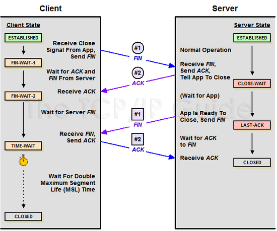

```
최초에는 서로 통신 상태이기 때문에 양쪽이 ESTABLISHED의 상태
1) Client > Server : FIN (통신 종료하자). Client의 상태 : FIN_WAIT_1

2) Server > Client : ACK (알겠어)
Server의 상태: CLOSE_WAIT(해당 클라이언트 포트에 연결되어있는 Application에게 close() 요청)
Client의 상태 : FIN_WAIT_2

3) Server > Client : FIN(나도 껐음)
Server의 상태 : LAST_ACK
Application은 최종적으로 close()

4) Client > Server : ACK (응 확인했어) 
Server의 상태 : CLOSED
Client의 상태 : TIME_WAIT...CLOSED
```

- FIN_WAIT_1 
  - 커넥션 종료 요청을 했는데 ACK를 받지 못한 상태로 기다리고 있는 것이다.
  - FIN_WAIT_1의 상태는 일정 시간이 지나면 **Time Out**이 되면 스스로 Closed하게 된다.
- FIN_WAIT_2
  - 클라이언트가 서버에 종료를 요청한 후 서버에서 요청을 접수했다고 ACK를 받았지만 서버에서 종료를 완료했다는 FIN 을 받지 못하고 기다리고 있는 상태
  - FIN_WAIT_2 역시 일정 시간이 지나면 **Time Out**이 되면 스스로 Closed하게 된다.

```
어떠한 이유에서 FIN_WAIT_1과 FIN_WAIT_2 상태인 연결이 많이 남아있다면 문제가 발생할 수 있다.

물론 일정 시간이 지나 Time Out이 되면 연결이 자동으로 종료되긴 하지만 
이 Time Out이 길어져 많은 수의 소켓이 늘어나게 되면 메모리 부족으로 더 이상 소켓을 오픈하지 못하는 경우가 발생한다.

이 경우는 네트워크나 방화벽 또는 Application에서 close()처리 등에 대한 문제등으로 발생할 수 있으며 원인을 찾기가 쉽지 않다.

이러한 문제 해결을 위해서 FIN_WAIT_1과 FIN_WAIT_2 의 Time Out 시간을 적절히 조절할 필요가 있다.
```

- TIME_WAIT
  - 서버에서 FIN 패킷을 전송하기 전에 전송한 패킷이 지연, 재전송 등으로 FIN 패킷보다 늦게 도착하는 상황이 발생할 수 있음
  - 클라이언트에서 세션을 종료시킨 후 뒤늦게 도착하는 패킷이 있다면 이 패킷은 drop되고 데이터는 유실될 것임
  - 이러한 현상에 대비해서 클라이언트는 서버로부터 FIN패킷을 수신하더라도 일정시간동안 세션을 남겨놓고 잉여 패킷을 기다리게 됨

### TIME-OUT

- Connection Timeout : TCP 3-way-handshake(connection) 을 구성하는 데 소요되는 시간의 임계치

- Socket Timeout : 각 패킷이 전송될 때 소요되는 시간의 임계치

  - 전체 응답시간이 아닌 개별 응답 시간임에 주의

  ```
  Socket Timeout : 1초
  응답 패킷 : 3개
  각 패킷 도착 시각 : 0.9초
  총 응답 시간 : 2.7초
  ```

  - 위와 같은 상황에서는 Socket Timeout이 발생하지 않는다.

    개별 패킷들이 1초 안에 도착하였기 때문이다.

  

  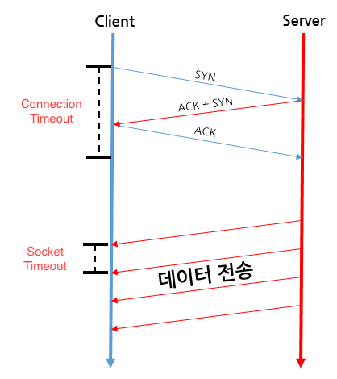

- 정리하자면 **Connection Timeout**과 **Socket Timeout** 설정은 **모두 필요**하다.

- 만약 두가지 timeout을 설정하지 않으면 url 접속 시 무한 대기가 발생할 수 있다.

### IPv4 (Public IP)

- [](https://github.com/qkraudghgh/coding-interview/blob/master/Network/images/ipv4.png)
- 크기가 32비트인 주소값으로 대게 `dotted-decimal notation`을 이용해 표기한다.
- dot으로 구분된 각 숫자는 8비트씩(octet) 나타낼 수 있으며 0~255의 범위를 나타낸다.


#### Class

- A Class: 처음 8bit(1byte)가 Network ID이며, 나머지 24bit(3Byte)가 Host ID이다. `(0.0.0.0 ~ 127.255.255.255)`
- B Class: 처음 16bit(2byte)가 Network ID이며, 나머지 16bit(2Byte)가 Host ID이다. `(128.0.0.0 ~ 191.255.255.255)`
- C Class: 처음 24bit(3byte)가 Network ID이며, 나머지 8bit(1Byte)가 Host ID이다. `(192.0.0.0 ~ 233.255.255.255)`
- D Class: Multicast(한 번의 송신으로 메시지나 정보를 여러 컴퓨터에 동시에 전송하는 것, 즉 그때 이용되는 IP)이다.
- E Class: 예약된 IP주소들로 미래에 쓰기위해 남겨두었다.
  - 실질적으로 D와 E Class의 경우 사용되는 경우는 거의 없음
- 네트워크 범위가 커질 수록 호스트 주소 범위는 작아진다! (반비례 관계)


### Private address (비공개 주소)

- 직접 인터넷에 연결되지 않고 NAT(Network Address Translation)을 이용해 인터넷에 접속되는 사설망
- 주소 대역이 3개로 고정되어있음
  - 192.168.xxx.xxx
  - 172.10.xxx.xxx
  - 10.xxx.xxx.xxx

- 사용하는 이유
  - IP주소를 공유하기 위함
  - IPv4의 주소 부족 문제를 해결할 수 있는 방안 중 하나


### IPv6

- IPv4의 32비트에서 128비트(16 octet)으로 증가하여 더 많은 IP주소를 할당할 수 있는 주소
- IPv4의 주소가 모자라게되면서 IPv4는 더 많은 주소를 네트워크에 할당하기 위해 `Network Fragmentation`이 지속적으로 증가하게되어 라우터에 많은 부담을 주고있어 이를 해결하기위해 IPv6가 새로 설계되었다.
