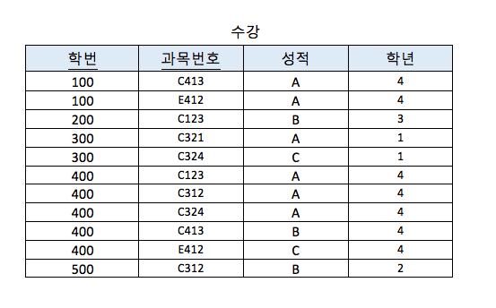
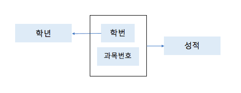
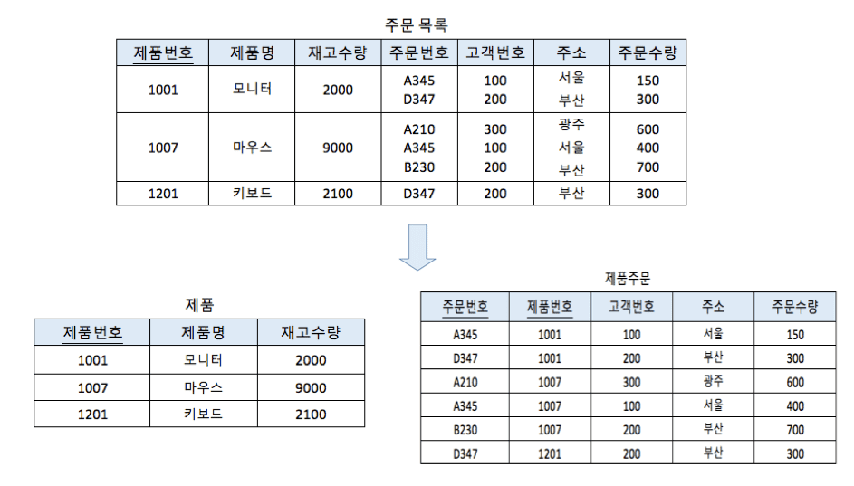
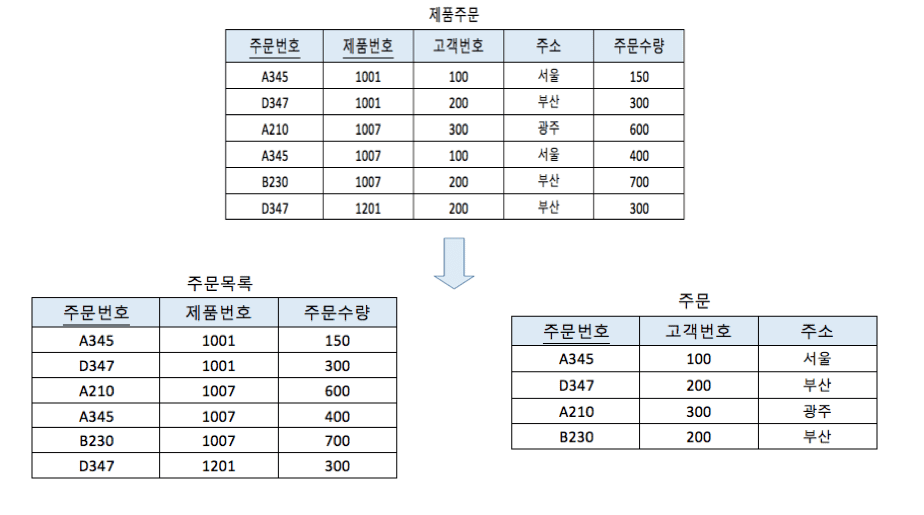
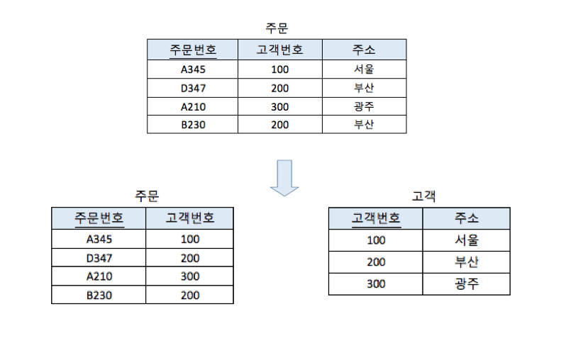
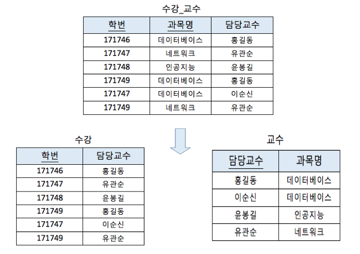
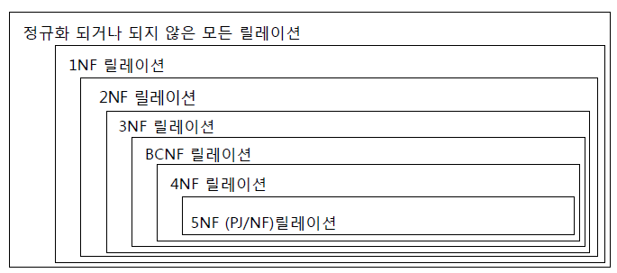
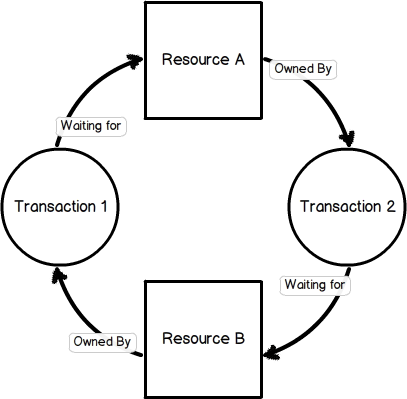

# DB: 정규화, 트랜잭션

> 교재 바탕으로 모르는 부분, 이미지, 예상 질문 추가


## 정규화(Normalization)에 대해서

### 1. 정규화는 어떤 배경에서 생겨났는가?

> 정규화의 최종 목적: 최종 목적은 이상 현상 발생 가능성을 줄이는 것

한 릴레이션(데이터를 원자 값으로 갖는 이차원 테이블)에 여러 엔티티*(실체, 객체. 저장되기 위한 어떤 것)*의 애트리뷰트*(속성: 의미상 더 이상 분리되지 않는 최소의 데이터 단위, 엔티티를 설명하는 요소, 컬럼?)*들을 혼합하게 되면 정보가 중복 저장되며, 저장 공간을 낭비하게 된다. 또 중복된 정보로 인해 `갱신(수정) 이상`이 발생하게 된다. 동일한 정보를 한 릴레이션에는 변경하고, 나머지 릴레이션에서는 변경하지 않은 경우 어느 것이 정확한지 알 수 없게 되는 것이다. 이러한 문제를 해결하기 위해 정규화 과정을 거치는 것이다.

#### 1-1. 갱신 이상에는 어떠한 것들이 있는가?

> 이상(Anomaly): 테이블에서 일부 속성(Attribute)들의 종속으로 인해 데이터의 중복이 발생, 이로 인해 테이블 조작 시 문제가 생기는 현상

- 삽입 이상(insertion anomalies): 원하지 않는 자료가 삽입된다든지, 삽입하는데 자료가 부족해 삽입이 되지 않아 발생하는 문제점을 말한다.
- 삭제 이상(deletion anomalies): 하나의 자료만 삭제하고 싶지만, 그 자료가 포함된 튜플 전체가 삭제됨으로 원하지 않는 정보 손실이 발생(>>연쇄 삭제)하는 문제점을 말한다.
- 수정(갱신)이상(modification anomalies): 정확하지 않거나 일부의 튜플만 갱신되어 정보가 모호해지거나 일관성이 없어져(불일치성, Incosistency) 정확한 정보 파악이 되지 않는 문제점을 말한다.


### 2. 그래서 정규화란 무엇인가?

> 상호 종속적인 관계를 갖는 특성을 이용하여 무손실 분해하는 과정

관계형 데이터베이스에서 중복을 최소화하기 위해 데이터를 구조화하는 작업이다. 좀 더 구체적으로는 불만족스러운 **나쁜** 릴레이션의 애트리뷰트들을 나누어서 **좋은** 작은 릴레이션으로 분해하는 작업을 말한다. 정규화 과정을 거치게 되면 정규형을 만족하게 된다. 정규형이란 특정 조건을 만족하는 릴레이션의 스키마의 형태를 말하며 제 1 정규형, 제 2 정규형, 제 3 정규형, … 등이 존재한다.

#### 2-1. ‘나쁜' 릴레이션은 어떻게 파악하는가?

엔티티를 구성하고 있는 애트리뷰트 간에 함수적 종속성(Functional Dependency)을 판단한다. 판단된 함수적 종속성은 좋은 릴레이션 설계의 정형적 기준으로 사용된다. 즉, 각각의 정규형마다 어떠한 함수적 종속성을 만족하는지에 따라 정규형이 정의되고, 그 정규형을 만족하지 못하는 정규형을 나쁜 릴레이션으로 파악한다.

#### 2-2. 함수적 종속성이란 무엇인가?

함수적 종속성이란 애트리뷰트 데이터들의 의미와 애트리뷰트들 간의 상호 관계로부터 유도되는 제약조건의 일종이다. X 와 Y 를 임의의 애트리뷰트 집합이라고 할 때, X 의 값이 Y 의 값을 유일하게(unique) 결정한다면 "X 는 Y 를 함수적으로 결정한다(X -> Y)"라고 한다. 함수적 종속성은 실세계에서 존재하는 애트리뷰트들 사이의 제약조건으로부터 유도된다. 또한 각종 추론 규칙에 따라서 애트리뷰트들간의 함수적 종속성을 판단할 수 있다. *cf> 애트리뷰트들의 관계로부터 추론된 함수적 종속성들을 기반으로 추론 가능한 모든 함수적 종속성들의 집합을 폐포라고 한다.*





- 수강 테이블의 속성 중 **성적**은 (학번, 과목번호)에 **완전 함수적 종속**(어떤 속성이 기본키에 대해 완전히 종속적 일 때)이라 한다.
- 수강 테이블의 속성 중 **학년**은 (학번, 과목번호)에 **완전 함수적 종속**이 아니므로 **부분 함수적 종속**(**기본키**가 2개 이상 구성된 **합성키**이고 합성키를 구성하는 하나의 속성에 함수적 종속성을 갖을 때)이라 한다.

#### 2-3. 각각의 정규형은 어떠한 조건을 만족해야 하는가?(테이블 분해 조건)

1. 분해의 대상인 분해 집합 D 는 **무손실 조인** 을 보장해야 한다.

   1. 무손실 조인 분해

      : 일반적으로 테이블 R 이 R1 R2로 분해되었을때 .....이 항상 성립
      : 분해된 테이블을 자연조인하였을때 원래의 테이블과 일치하여야함

      - 무손실 분해 조건
        : 분해된 테이블의 공통 필드 집합이 둘 중 하나의 테이블에서 키가 되는 경우

2. 분해 집합 D 는 함수적 종속성을 보존해야 한다.

   1. 종속성 보존 분해

      : 분해되기 전의 함수적 종속들이 분해 후에도 유지되어야 함

### 제 1 정규형

> 모든 속성의 도메인이 **원자 값(Atomic Value)**만으로 되어 있는 정규형

애트리뷰트의 도메인(하나의 Attribute가 취할 수 있는 같은 타입의 원자 값(Atomic Value)들의 집합. 컬럼 값들의 집합이겠죠? => 필드에 채워질 수 있는 값의 집합)이 오직 `원자값`만을 포함하고, 튜플(행, 레코드)의 모든 애트리뷰트가 도메인에 속하는 하나의 값을 가져야 한다. 즉, 복합 애트리뷰트, 다중값 애트리뷰트, 중첩 릴레이션 등 비 원자적인 애트리뷰트들을 허용하지 않는 릴레이션 형태를 말한다.



- ‘주문 목록’ 테이블에서는

  하나의 제품에 여러 개의 주문 관련 정보 (주문번호, 고객번호, 주소, 주문수량)가 발생하고 있다.

  따라서 ‘주문 목록’ 테이블은 제 1정규형이 아니다.

- 1차 정규화 과정으로 생성된 <제품주문> 테이블의 기본키는 (주문번호, 제품번호)이고

  다음과 같은 함수적 종속이 존재한다.

```
* 주문번호, 제품번호 --> 고객번호, 주소, 주문수량
* 주문번호 --> 고객번호, 주소
* 고객번호 --> 주소 
```

### 제 2 정규형

>테이블 R이 제 1정규형이고 **기본키**가 아닌 **모든 속성**이 기본키에 대하여 **완전 함수적 종속**을 만족하는 정규형

모든 비주요 애트리뷰트들이 주요 애트리뷰트에 대해서 **완전 함수적 종속이면** 제 2 정규형을 만족한다고 볼 수 있다. 완전 함수적 종속이란 `X -> Y` 라고 가정했을 때, X 의 어떠한 애트리뷰트라도 제거하면 더 이상 함수적 종속성이 성립하지 않는 경우를 말한다. 즉, 키가 아닌 열들이 각각 후보키에 대해 결정되는 릴레이션 형태를 말한다.



- 제 2정규화 과정을 거쳐 생성된 <주문> 테이블의 기본키는 주문번호이다.

  그리고 <주문> 테이블에는 아직도 다음과 같은 함수적 종속들이 존재한다.

```
* 주문번호 --> 고객번호, 주소
* 고객번호 --> 주소 
```

### 제 3 정규형

> 테이블 R이 제 2정규형이고 **기본키**가 아닌 **모든 속성**이 기본키에 대해 **이행적 함수적 종속**을 만족하지 않는 정규형

어떠한 비주요 애트리뷰트도 기본키에 대해서 **이행적으로 종속되지 않으면** 제 3 정규형을 만족한다고 볼 수 있다. 이행 함수적 종속이란 `X - >Y`, `Y -> Z`의 경우에 의해서 추론될 수 있는 `X -> Z`의 종속관계를 말한다. 즉, 비주요 애트리뷰트가 비주요 애트리뷰트에 의해 종속되는 경우가 없는 릴레이션 형태를 말한다.



- ‘주문’ 테이블에서 고객번호가 주문번호에 함수적 종속이고

  주소가 고객번호에 함수적 종속이므로

  주소는 기본키인 주문번호에 대해 이행적 함수적 종속을 만족한다.

  즉 [주문번호 -> 고객번호]이고 [고객번호 -> 주소]이므로

  [주문번호 -> 주소]는 이행적 함수적 종속이 된다.

  따라서 ‘주문’ 테이블은 제 3정규형이 아니다.

### BCNF(Boyce-Codd) 정규형

> 테이블 R에서 모든 결정자가 **후보키(Candidate Key)** 정규형
>
> 일반적으로 제 3정규형에 후보키가 여러 개 존재하고 이러한 후보키들이 서로 중첩되어 나타나는 경우에 적용

여러 후보 키가 존재하는 릴레이션에 해당하는 정규화 내용이다. 복잡한 식별자 관계에 의해 발생하는 문제를 해결하기 위해 제 3 정규형을 보완하는데 의미가 있다. 비주요 애트리뷰트가 후보키의 일부를 결정하는 분해하는 과정을 말한다.

*각 정규형은 그의 선행 정규형보다 더 엄격한 조건을 갖는다.*

- 모든 제 2 정규형 릴레이션은 제 1 정규형을 갖는다.
- 모든 제 3 정규형 릴레이션은 제 2 정규형을 갖는다.
- 모든 BCNF 정규형 릴레이션은 제 3 정규형을 갖는다.

수많은 정규형이 있지만 관계 데이터베이스 설계의 목표는 각 릴레이션이 3NF(or BCNF)를 갖게 하는 것이다.



- ‘수강 교수’ 테이블은 함수적 종속

  (학번, 과목명) –> 담당교수

  (학번, 담당교수) –> 과목명

  (담당교수 –> 과목명) 을 만족하고 있다.

- ‘수강 교수’ 테이블의 후보키는 (학번, 과목명)과 (학번, 담당교수)이다.

- ‘수강 교수’ 테이블에서 결정자 중 후보키가 아닌 속성이 존재한다.

  즉 함수적 종속 [담당교수 –> 과목명]이 존재하는데

  담당교수가 ‘수강 교수’ 테이블에서 후보키가 아니기 때문에

  ‘수강 교수’ 테이블은 BCNF가 아니다.



대부분의 릴레이션에서는 BCNF까지 정규화하면 실제적인 이상현상이 없어지기 때문에 BCNF 까지 정규화를 한다.


### 3. 정규화에는 어떠한 장점이 있는가?

1. 데이터베이스 변경 시 이상 현상(Anomaly) 제거 위에서 언급했던 각종 이상 현상들이 발생하는 문제점을 해결할 수 있다.
2. 데이터베이스 구조 확장 시 재 디자인 최소화 정규화된 데이터베이스 구조에서는 새로운 데이터 형의 추가로 인한 확장 시, 그 구조를 변경하지 않아도 되거나 일부만 변경해도 된다. 이는 데이터베이스와 연동된 응용 프로그램에 최소한의 영향만을 미치게 되며 응용프로그램의 생명을 연장시킨다.
3. 사용자에게 데이터 모델을 더욱 의미있게 제공 정규화된 테이블들과 정규화된 테이블들간의 관계들은 현실 세계에서의 개념들과 그들간의 관계들을 반영한다.


### 4. 단점은 없는가?

릴레이션의 분해로 인해 릴레이션 간의 연산(JOIN 연산)이 많아진다. 이로 인해 질의에 대한 응답 시간이 느려질 수 있다. 조금 덧붙이자면, 정규화를 수행한다는 것은 데이터를 결정하는 결정자에 의해 함수적 종속을 가지고 있는 일반 속성을 의존자로 하여 입력/수정/삭제 이상을 제거하는 것이다. 데이터의 중복 속성을 제거하고 결정자에 의해 동일한 의미의 일반 속성이 하나의 테이블로 집약되므로 한 테이블의 데이터 용량이 최소화되는 효과가 있다. 따라서 정규화된 테이블은 데이터를 처리할 때 속도가 빨라질 수도 있고 느려질 수도 있는 특성이 있다.


### 5. 단점에서 미루어보았을 때 어떠한 상황에서 정규화를 진행해야 하는가? 단점에 대한 대응책은?

조회를 하는 SQL 문장에서 조인이 많이 발생하여 이로 인한 성능저하가 나타나는 경우에 반정규화를 적용하는 전략이 필요하다.

#### 반정규화(De-normalization, 비정규화)

`반정규화`는 정규화된 엔티티, 속성, 관계를 시스템의 성능 향상 및 개발과 운영의 단순화를 위해 중복 통합, 분리 등을 수행하는 데이터 모델링 기법 중 하나이다. 디스크 I/O 량이 많아서 조회 시 성능이 저하되거나, 테이블끼리의 경로가 너무 멀어 조인으로 인한 성능 저하가 예상되거나, 칼럼을 계산하여 조회할 때 성능이 저하될 것이 예상되는 경우 반정규화를 수행하게 된다. 일반적으로 조회에 대한 처리 성능이 중요하다고 판단될 때 부분적으로 반정규화를 고려하게 된다.

#### 5-1. 무엇이 반정규화의 대상이 되는가?

1. 자주 사용되는 테이블에 액세스하는 프로세스의 수가 가장 많고, 항상 일정한 범위만을 조회하는 경우
2. 테이블에 대량 데이터가 있고 대량의 범위를 자주 처리하는 경우, 성능 상 이슈가 있을 경우
3. 테이블에 지나치게 조인을 많이 사용하게 되어 데이터를 조회하는 것이 기술적으로 어려울 경우

#### 5-2. 반정규화 과정에서 주의할 점은?

반정규화를 과도하게 적용하다 보면 데이터의 무결성이 깨질 수 있다. 또한 입력, 수정, 삭제의 질의문에 대한 응답 시간이 늦어질 수 있다.


정규화 더 참고: https://mangkyu.tistory.com/110


### 예상 질문

- 정규화에 대한 설명
- 정규화의 장단점
- 반정규화를 하는 이유
- 이상현상의 종류


## Transaction

### 트랜잭션(Transaction)이란 무엇인가?

> 데이터베이스에서 하나의 논리적 기능을 수행하기 위한 일련의 연산 집합으로서 작업의 단위

트랜잭션은 작업의 **완전성** 을 보장해주는 것이다. 즉, 논리적인 작업 셋을 모두 완벽하게 처리하거나(commit) 또는 처리하지 못할 경우에는 원 상태로 복구해서 작업의 일부만 적용되는 현상이 발생하지 않게 만들어주는(rollback) 기능이다. 사용자의 입장에서는 작업의 논리적 단위로 이해를 할 수 있고 시스템의 입장에서는 데이터들을 접근 또는 변경하는 프로그램의 단위가 된다.


### 트랜잭션과 Lock

잠금(Lock)과 트랜잭션은 서로 비슷한 개념 같지만 사실 **잠금**은 *동시성을 제어*하기 위한 기능이고 **트랜잭션**은 *데이터의 정합성을 보장*하기 위한 기능이다. 잠금은 여러 커넥션에서 동시에 동일한 자원을 요청할 경우 순서대로 한 시점에는 하나의 커넥션만 변경할 수 있게 해주는 역할을 한다. 여기서 자원은 레코드나 테이블을 말한다. 이와는 조금 다르게 트랜잭션은 꼭 여러 개의 변경 작업을 수행하는 쿼리가 조합되었을 때만 의미있는 개념은 아니다. 트랜잭션은 하나의 논리적인 작업 셋 중 하나의 쿼리가 있든 두 개 이상의 쿼리가 있든 관계없이 논리적인 작업 셋 자체가 100% 적용되거나 아무것도 적용되지 않아야 함을 보장하는 것이다. 예를 들면 HW 에러 또는 SW 에러와 같은 문제로 인해 작업에 실패가 있을 경우, 특별한 대책이 필요하게 되는데 이러한 문제를 해결하는 것이다.


### 트랜잭션의 특성

*트랜잭션은 어떠한 특성을 만족해야할까?* Transaction 은 다음의 ACID 라는 4 가지 특성을 만족해야 한다. ACID는 데이터베이스 트랜잭션이 안전하게 수행됨을 보장한다.

#### 원자성(Atomicity)

> 트랜잭션의 연산은 데이터베이스에 `All` or `Nothing` 반영되어야 한다.

만약 트랜잭션 중간에 어떠한 문제가 발생한다면 트랜잭션에 해당하는 어떠한 작업 내용도 수행되어서는 안되며 아무런 문제가 발생되지 않았을 경우에만 모든 작업이 수행되어야 한다.

#### 일관성(Consistency)

> 트랜잭션 수행이 **성공적으로 완료**되면 언제나 **`일관성` 있는 데이터베이스 상태를 유지**한다.

트랜잭션이 완료된 다음의 상태에서도 트랜잭션이 일어나기 전의 상황과 동일하게 데이터의 일관성을 보장해야 한다.

#### 고립성(독립성, Isolation)

> 한 트랜잭션이 작업을 하는동안 `완료되기 전`에는 작업중인 데이터를 다른 트랜잭션들이 접근하지 못하도록 해야한다.

각각의 트랜잭션은 서로 간섭없이 독립적으로 수행되어야 한다.

공식적으로 고립성은 트랜잭션 실행내역은 **연속적**이어야 함을 의미한다.

#### 지속성(영속성, Durability)

> 트랜잭션의 실행이 성공적으로 실행 완료된 후에는 시스템에 오류가 발생하더라도 변경된 내용은 **계속 `보존`**되어야 한다.

트랜잭션이 정상적으로 종료된 다음에는 영구적으로 데이터베이스에 작업의 결과가 저장되어야 한다.


### Commit연산

- Commit 연산은 한개의 논리적 단위(트랜잭션)에 대한 작업이 성공적으로 끝났고 데이터베이스가 다시 일관된 상태에 있을 때, 이 트랜잭션이 행한 갱신 연산이 완료된 것을 트랜잭션 관리자에게 알려주는 연산이다.

 

### Rollback연산

- Rollback 연산은 하나의 트랜잭션 처리가 비정상적으로 종료되어 데이터베이스의 일관성을 깨뜨렸을 때, 이 트랜잭션의 일부가 정상적으로 처리되었더라도 트랜잭션의 원자성을 구현하기 위해 이 트랜잭션이 행한 모든 연산을 취소(Undo)하는 연산이다.

- Rollback시에는 해당 트랜잭션을 재시작하거나 폐기한다.


### 트랜잭션의 상태


#### Active(활동)

트랜잭션의 활동 상태. 트랜잭션이 실행중이며 동작중인 상태를 말한다.

#### Failed(실패)

트랜잭션 실패 상태. 트랜잭션이 더이상 정상적으로 진행 할 수 없는 상태를 말한다.

#### Partially Committed(부분 완료)

트랜잭션의 `Commit` 명령이 도착한 상태. 트랜잭션의 `commit`이전 `sql`문이 수행되고 `commit`만 남은 상태를 말한다. (트랜잭션의 마지막 연산까지 실행했지만, `commit` 연산이 실행되기 직전의 상태)

#### Committed(완료)

트랜잭션 완료 상태. 트랜잭션이 정상적으로 완료된 상태(`commit` 연산 실행)를 말한다.

#### Aborted(철회)

트랜잭션이 취소 상태. 트랜잭션이 취소되고 트랜잭션 실행 이전 데이터로 돌아간 상태(`rollback` 연산 실행)를 말한다.

#### Partially Committed 와 Committed 의 차이점

`Commit` 요청이 들어오면 상태는 `Partial Commited` 상태가 된다. 이후 `Commit`을 문제없이 수행할 수 있으면 `Committed` 상태로 전이되고, 만약 오류가 발생하면 `Failed` 상태가 된다. 즉, `Partial Commited`는 `Commit` 요청이 들어왔을때를 말하며, `Commited`는 `Commit`을 정상적으로 완료한 상태를 말한다.

### 트랜잭션을 사용할 때 주의할 점

트랜잭션은 꼭 필요한 최소의 코드에만 적용하는 것이 좋다. 즉 트랜잭션의 범위를 최소화하라는 의미다. 일반적으로 데이터베이스 커넥션은 개수가 제한적이다. 그런데 각 단위 프로그램이 커넥션을 소유하는 시간이 길어진다면 사용 가능한 여유 커넥션의 개수는 줄어들게 된다. 그러다 어느 순간에는 각 단위 프로그램에서 커넥션을 가져가기 위해 기다려야 하는 상황이 발생할 수도 있는 것이다.

### 교착상태(Dead Lock)

#### 교착상태란 무엇인가

> 여러 개의 트랜잭션들이 실행을 못하고 서로 무한정 기다리는 상태

복수의 트랜잭션을 사용하다보면 교착상태가 일어날수 있다. 교착상태란 두 개 이상의 트랜잭션이 특정 자원(테이블 또는 행)의 잠금(Lock)을 획득한 채 다른 트랜잭션이 소유하고 있는 잠금을 요구하면 아무리 기다려도 상황이 바뀌지 않는 상태가 되는데, 이를 `교착상태`라고 한다.


#### 교착상태의 예(MySQL)

MySQL [MVCC](https://en.wikipedia.org/wiki/Multiversion_concurrency_control)에 따른 특성 때문에 트랜잭션에서 갱신 연산(Insert, Update, Delete)를 실행하면 잠금을 획득한다. (기본은 행에 대한 잠금)




트랜잭션 1이 테이블 B의 첫번째 행의 잠금을 얻고 트랜잭션 2도 테이블 A의 첫번째 행의 잠금을 얻었다고 하자.

```
Transaction 1> create table B (i1 int not null primary key) engine = innodb;
Transaction 2> create table A (i1 int not null primary key) engine = innodb;

Transaction 1> start transaction; insert into B values(1);
Transaction 2> start transaction; insert into A values(1);
```

트랜잭션을 commit 하지 않은채(작업 완료 안된 상태인 것임) 서로의 첫번째 행에 대한 잠금을 요청하면

```
Transaction 1> insert into A values(1);
Transaction 2> insert into B values(1);
ERROR 1213 (40001): Deadlock found when trying to get lock; try restarting transaction
```

Deadlock 이 발생한다. 일반적인 DBMS는 교착상태를 독자적으로 검출해 보고한다.

#### 교착 상태의 빈도를 낮추는 방법

- 트랜잭션을 자주 커밋한다.
- 정해진 순서로 테이블에 접근한다. 위에서 트랜잭션 1 이 테이블 B -> A 의 순으로 접근했고, 트랜잭션 2 는 테이블 A -> B의 순으로 접근했다. 트랜잭션들이 동일한 테이블 순으로 접근하게 한다.
- 읽기 잠금 획득 (SELECT ~ FOR UPDATE)의 사용을 피한다.
- 한 테이블의 복수 행을 복수의 연결에서 순서 없이 갱신하면 교착상태가 발생하기 쉽다, 이 경우에는 테이블 단위의 잠금을 획득해 갱신을 직렬화 하면 동시성을 떨어지지만 교착상태를 회피할 수 있다.
- 등등


### 예상 질문

- 트랜잭션에 대한 설명
- 트랜잭션의 특성(ACID) 설명
- 데드락에 대한 설명