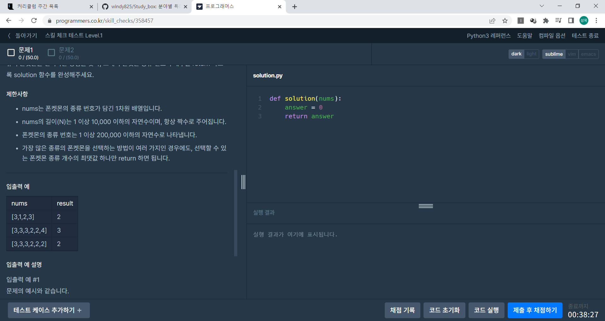
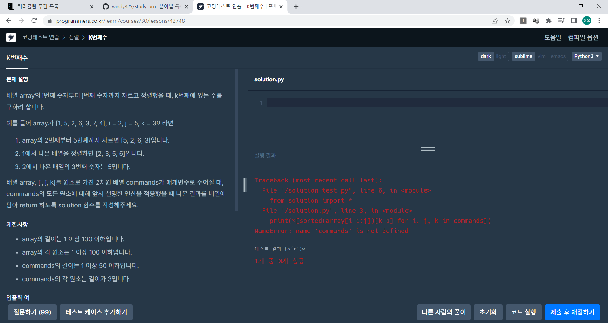

## 프로그래머스 문제 푸는 방법

혹시라도 백준, SWEA와 달라 적응하기 힘드신 분들이 계실까봐 작성합니다.




문제에 들어가면 위 화면과 비슷한 화면이 나옵니다.

이 때, 오른쪽에는 항상 def solution이 등장하고 이 solution 안에 코드를 작성해야합니다.

SWEA나 백준과는 방식이 달라서 헷갈릴 수 있는데, 이 방법을 기존의 방식과 비교해보자면


```python
# 백준, SWEA
nums = list(map(int, input))

'''
원하는 코드 작성
'''

print(answer)
```


이와 같이 input을 따로 받고, 이를 활용해서 문제를 푸는 것이 일반적이었습니다만, 프로그래머스에서는 input을 따로 받지 않습니다. 위 프로그래머스 코드를 백준이나 SWEA 형태로 바꿔서 작성하면 아래와 같아집니다.


```python
# nums가 [3, 1, 2, 3]인 경우
def solution(nums):
    answer = 0
    return answer

print(solution([3, 1, 2, 3]))
```


이런 느낌으로 생각해서, input에 대한 부분은 생각하지 않고 문제를 푸시면 되겠습니다.

또한 pycharm이나 VScode 등을 활용할 때에는 위와 같은 형태로 작성하시면 도움이 되실 듯 합니다.


---

## 주의사항

- solution 부분을 전부 지우고 백준 형식으로 작성하여도 변수를 받는 부분이 없어 NameError가 발생합니다.
- 또한, 재귀로 코드를 작성할 경우 추가로 함수에 대한 정의를 시행하면 변수를 global 선언할 수가 없으므로, 해당 부분에 주의하면서 작성하시면 되겠습니다.


---

*end*