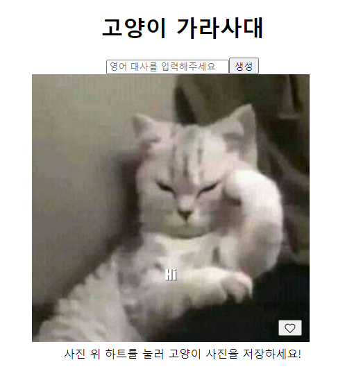
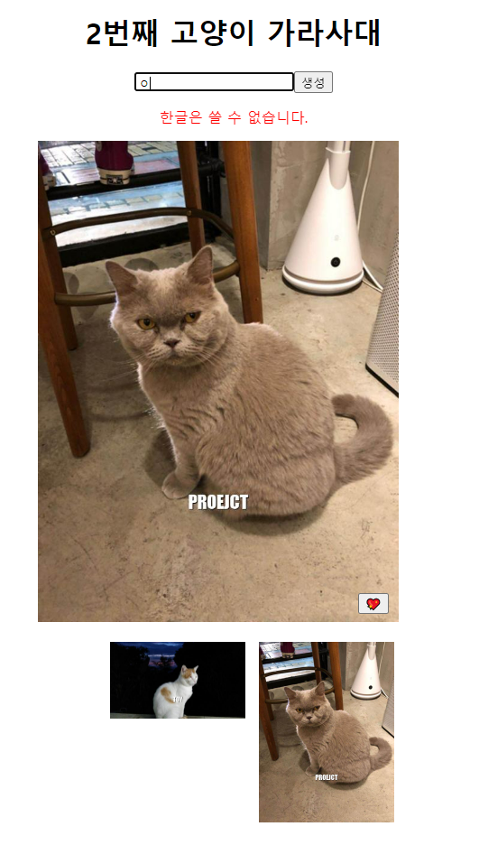

### 고양이 짤 만들기



### 1. 사용 API

https://cataas.com/#/ 접속

Random cat in JSON통해 IMG 불러오기


기능 명세

```
1. API를 사용하여 고양이 랜덤 img를 rendering
2. Input에 입력은 영어 대문자만 입력 되도록 하며 생성 버튼 클릭 시 해당 문자를 가진
   고양이 이미지 생성
  - 한글을 쓸 경우 input박스 밑 한글은 쓸 수 없다는 안내 문구 표시
3. 고양이는 하트가 가능하며, 하트를 눌러 고양이 사진을 저장(localstorage사용)
  - 좋아요한 고양이가 없을 경우, 좋아요 버튼 클릭 유도 문구 삽입
4. 고양이를 생성하면, n번째 고양이 가라사대로 변경
  - 없을 경우 '고양이 가라사대'만 보이도록 표시
```

