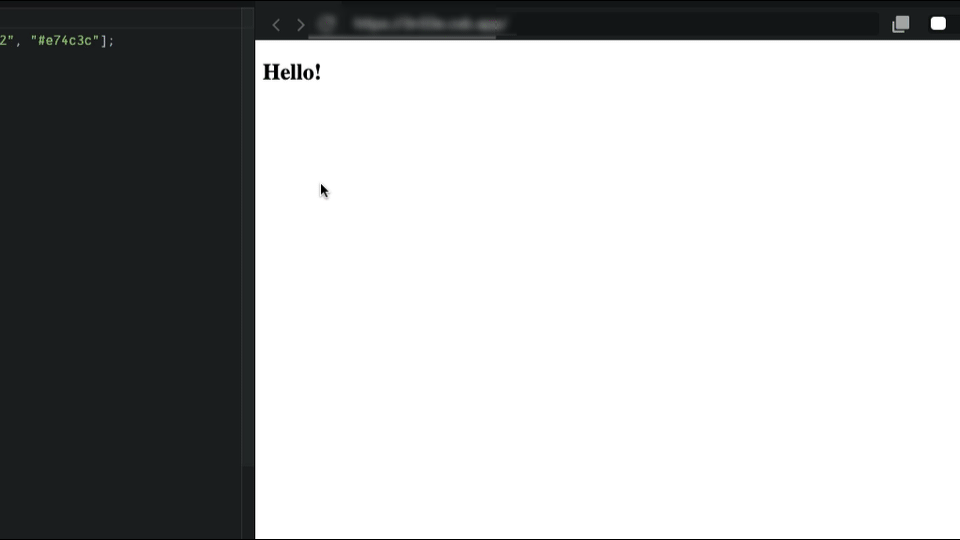

### Using the boilerplate, make an app that does the following:

제공되는 보일러 플레이트를 사용해 아래의 예시와 동일하게 작동하는 애플리케이션을 만드세요.

<br>



<br>

### 조건

1. 마우스가 `title`위로 올라가면 텍스트가 변경되어야 합니다.
2. 마우스가 `title`을 벗어나면 텍스트가 변경되어야 합니다.
3. 브라우저 창의 사이즈가 변하면 `title`이 바뀌어야 합니다.
4. 마우스를 우 클릭하면 `title`이 바뀌어야 합니다.
5. `title`의 색상은 `colors` 배열에 있는 색을 사용해야 합니다.
6. `.css` 와 `.html` 파일은 수정하지 마세요.
7. 모든 함수 핸들러는 `superEventHandler`내부에 작성해야 합니다.
8. 모든 조건이 충족되지 못하면 ❌를 받습니다.

<br>

### 결과물

```html
// index html

<!DOCTYPE html>
<html>
  <head>
    <title>Parcel Sandbox</title>
    <meta charset="UTF-8" />
  </head>

  <body>
    <h2>Hello!</h2>
    <script src="src/index.js"></script>
  </body>
</html>
```

<br>

```css
// style.css

body {
  font-family: sans-serif;
}

```

<br>

```js
// index.js

// <⚠️ DONT DELETE THIS ⚠️>
import "./styles.css";
const colors = ["#1abc9c", "#3498db", "#9b59b6", "#f39c12", "#e74c3c"];
// <⚠️ /DONT DELETE THIS ⚠️>

/*
✅ The text of the title should change when the mouse is on top of it.
✅ The text of the title should change when the mouse is leaves it.
✅ When the window is resized the title should change.
✅ On right click the title should also change.
✅ The colors of the title should come from a color from the colors array.
✅ DO NOT CHANGE .css, or .html files.
✅ ALL function handlers should be INSIDE of "superEventHandler"
*/
const h2 = document.querySelector("h2");

const superEventHandler = {
  whenMouseEnter() {
    h2.innerText = "The mouse is here!";
    h2.style.color = colors[0];
  },
  whenMouseLeave() {
    h2.innerText = "The mouse is gone!";
    h2.style.color = colors[1];
  },
  whenWindowResized() {
    h2.innerText = "You just resized!";
    h2.style.color = colors[2];
  },
  whenWindowContextMenu() {
    h2.innerText = "That was a right click!";
    h2.style.color = colors[3];
  }
};

h2.addEventListener("mouseenter", superEventHandler.whenMouseEnter);
h2.addEventListener("mouseleave", superEventHandler.whenMouseLeave);
window.addEventListener("resize", superEventHandler.whenWindowResized);
window.addEventListener("contextmenu", superEventHandler.whenWindowContextMenu);
```

<br>

<br>

### 제출 코드 링크

- [링크](https://codesandbox.io/s/stupefied-glitter-6te8tj)